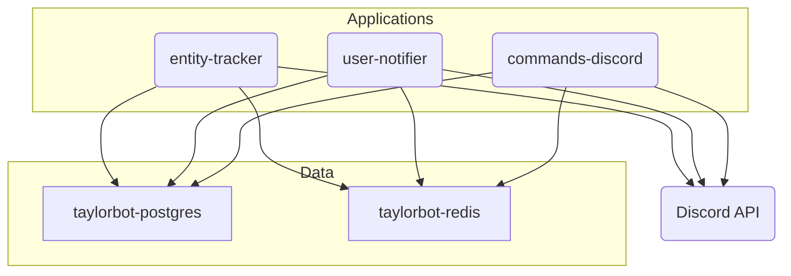

# Coding
Write code like a technical fellow, always following best practices and keeping up with modern patterns.
Write elegant, readable, maintainable, clean code.
In C#, always write code using modern language features where applicable such as nullable reference types, target-typed new (or var if not applicable), record types, using declaration without braces, file-scoped namespaces, implicit usings, interpolated strings, collection expressions, raw string literals, primary constructors, relational and logical patterns, System.Threading.Lock, async streams, indices/ranges, default literal, throw expressions, null-coalescing, out variables and pattern matching.

# Repository Context
This repository is TaylorBot, a multi-purpose Discord bot that brings fun to your server with a taypoint economy, helps you moderate better & provides useful chat features like timezones, weather, Last.fm integration and more!

## Architecture
TaylorBot is made up of multiple components, most of which built and ran using Docker containers:

[taylorbot-postgres](src/taylorbot-postgres) is the PostgreSQL-based core database storing all persistent data. The database schema is managed using a tool called Sqitch.
[taylorbot-redis](src/taylorbot-redis) is a Redis server used as a cache for heavily fetched data from `taylorbot-postgres`. Caching avoids frequent round-trips to the database, which could significantly impact performance.
[taylorbot-entity-tracker](src/TaylorBot.Net) is a .NET application based on [Discord.Net](https://github.com/discord-net/Discord.Net). Its main responsibilities are remembering usernames/joined dates, counting messages/minutes and logging member joins.
[taylorbot-user-notifier](src/TaylorBot.Net) is a .NET application based on Discord.Net. Its main responsibilities are sending out reminders, logging member leaves/bans, logging messages and notifying of new social posts.
[taylorbot-commands-discord](src/TaylorBot.Net) is a .NET application based on Discord.Net. Its main responsibilities are responding to interactions (slash commands) and legacy prefixed commands.
[slash-commands](src/slash-commands) is not really a component itself, but simply a collection of `.json` files representing all TaylorBot slash commands. To update available slash commands, a file is added or edited, then a deployment is made to push the `.json` contents to Discord's API.
components define `.yml` files that represent build and deploy steps for Azure Pipelines.
