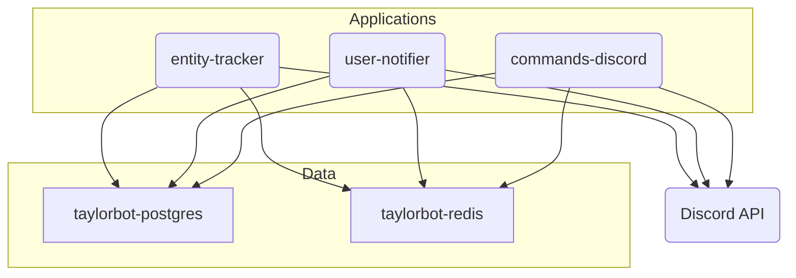

# TaylorBot

This repository is the home of the source code to TaylorBot, a multi-purpose Discord bot originally created for the r/TaylorSwift Discord server in **November 2015**. However, this source goes back to **September 2017**, when it was decided to do a complete rewrite. For an early code archive, see [TaylorBot.Classic](https://github.com/adamgauthier/TaylorBot.Classic).

## Architecture

TaylorBot is made up of multiple components, which can be built and ran using [Docker](https://www.docker.com/) containers. This architecture allows most features to remain available if one component is experiencing downtime. The use of containers means all components can be ran regardless of OS environment, as long as Docker is installed.



### taylorbot-postgres

[taylorbot-postgres](./src/taylorbot-postgres) is the [PostgreSQL](https://www.postgresql.org/)-based core database storing all persistent data. Note that while you can deploy this database locally using Docker, the production instance of TaylorBot uses a dedicated managed cloud service. The database schema is managed using a tool called [Sqitch](https://sqitch.org/), which you will need to run to create it as well as every time you make a change to it.

### taylorbot-redis

[taylorbot-redis](./src/taylorbot-redis) is a [Redis](https://redis.io/) server used as a cache for heavily fetched data from `taylorbot-postgres`. Caching avoids frequent round-trips to the database, which could significantly impact performance.

### entity-tracker

[taylorbot-entity-tracker](./src/TaylorBot.Net) is a [.NET](https://dotnet.microsoft.com/) application based on [Discord.Net](https://github.com/discord-net/Discord.Net). Its main responsibilities are remembering usernames/joined dates, counting messages/minutes and logging member joins.

### user-notifier

[taylorbot-user-notifier](./src/TaylorBot.Net) is a [.NET](https://dotnet.microsoft.com/) application based on [Discord.Net](https://github.com/discord-net/Discord.Net). Its main responsibilities are sending out reminders, logging member leaves/bans, logging messages and notifying of new social posts.

### commands-discord

[taylorbot-commands-discord](./src/TaylorBot.Net) is a [.NET](https://dotnet.microsoft.com/) application based on [Discord.Net](https://github.com/discord-net/Discord.Net). Its main responsibilities are responding to interactions (slash commands) and legacy prefixed commands.

### slash-commands

[slash-commands](./src/slash-commands) is not really a component itself, but simply a collection of `.json` files representing all TaylorBot slash commands. To update available slash commands, a file is added or edited, then a deployment is made to push the `.json` contents to Discord's API.

### pipelines

Components define `.yml` files that represent build and deploy steps for [Azure Pipelines](https://docs.microsoft.com/en-us/azure/devops/pipelines/), which is a cloud-based CI/CD service. These build steps are triggered automatically to validate code changes, while the deploy steps are triggered manually when a deployment is needed.


## Get Started

To run TaylorBot locally, make sure you [install Docker](https://docs.docker.com/engine/install/) and [install PowerShell](https://learn.microsoft.com/en-us/powershell/scripting/install/installing-powershell) if you haven't already.

The first step is to run an instance of [taylorbot-postgres](./src/taylorbot-postgres).

Create a copy of [`template.postgres.Local.json`](src/taylorbot-postgres/template.postgres.Local.json) and rename it to `postgres.Local.json`. Edit the file to create a postgres password and taylorbot role password you will be using. Then, run in powershell:
```pwsh
cd ./src/taylorbot-postgres/
./Deploy-Postgres.ps1
```

You should now have a `taylorbot-postgres` container running. The next step is to run an instance of [taylorbot-redis](./src/taylorbot-redis).

Create a copy of [`template.redis.Local.json`](src/taylorbot-redis/template.redis.Local.json) and rename it to `redis.Local.json`. Edit the file to create a redis password you will be using. Then, run in powershell:
```pwsh
cd ./src/taylorbot-redis/
./Deploy-Redis.ps1
```

Now that you have the data layer setup, the next step is to run TaylorBot. The best component to start with is [taylorbot-commands-discord](./src/TaylorBot.Net).

Create a copy of [`template.commands-discord.secrets.env`](src/TaylorBot.Net/Program.Commands.Discord/template.commands-discord.secrets.env) and rename it to `commands-discord.local.secrets.env`. Edit the file to include the role password (`databasepassword=`) and the redis password (`redispassword=`) you created in the previous steps. Make sure you also include your Discord bot token (`discordtoken=`) for the account TaylorBot will be logging into. All other secrets are optional for now. Then, run in powershell:
```pwsh
cd ./src/TaylorBot.Net/Program.Commands.Discord/
./Build-CommandsDiscord.ps1
./Deploy-CommandsDiscord.ps1 -SecretsFile ./commands-discord.local.secrets.env
```

You should now have an instance of TaylorBot running successfully! Type `!avatar` in a server where your bot is present.
